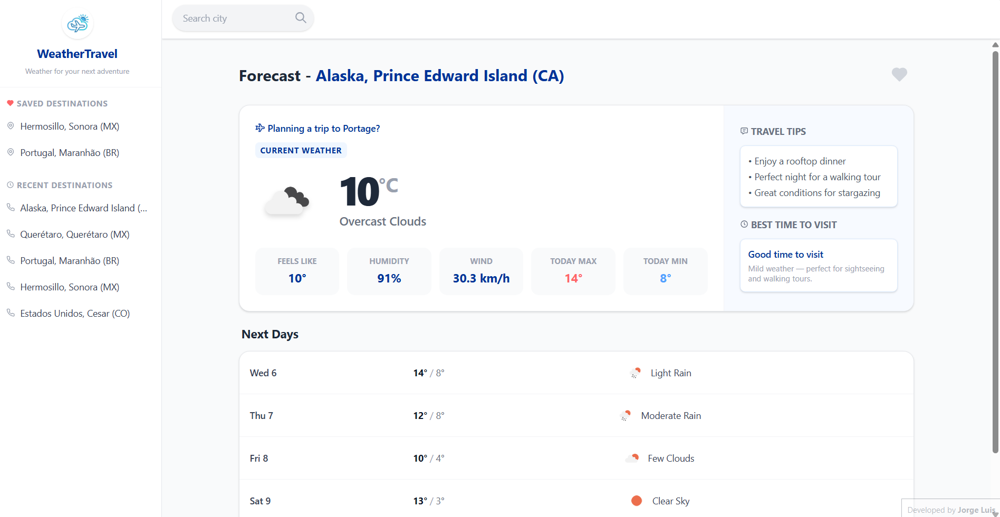

# WeatherTravel

**Live site:** [Visit WeatherTravel](https://weathertravel.vercel.app/)

**WeatherTravel** is a responsive weather forecast web application built with Angular, designed for travelers who want to check weather conditions before and during their trips.

## Features

- **Smart Search:** City autocomplete with debounce optimization and real-time feedback.
- **Travel-Oriented Forecast:** Current weather with travel tips, best time to visit rating, and a 5-day forecast.
- **Data Persistence:** Favorites and search history stored in `localStorage`.
- **Responsive Design:** Adaptive layout with a dynamic sidebar for both mobile and desktop.
- **Error Handling:** Friendly messages for no connection, city not found, and invalid API key.

## Technologies

- **Angular 21** (Standalone Components)
- **Tailwind CSS**
- **TypeScript**
- **OpenWeatherMap API**

## Architecture

```
src/app/
├── core/
│   ├── weather.ts               # HTTP service (search, current weather, forecast)
│   └── logging-interceptor.ts   # HTTP logging interceptor
├── shared/pipes/
│   └── kelvin-to-celsius-pipe.ts
└── components/
    ├── search/                  # Autocomplete search input
    ├── sidebar/                 # Saved & recent destinations
    ├── weather-card/            # Current weather + travel tips
    └── fore-cast/                # 5-day forecast grid
```

## Setup

1. **Clone the repository:**
   ```bash
   git clone https://github.com/Jorgedr12/AngularClima
   cd weather-travel
   ```

2. **Install dependencies:**
   ```bash
   npm install
   ```

3. **Configure your API Key:**

   - Sign up at [OpenWeatherMap](https://openweathermap.org/) and get your free API key.
   - Create the file `src/environments/environment.development.ts`.
   - Replace the placeholder with your key:
     ```typescript
     export const environment = {
       openWeatherMapApiKey: 'YOUR_API_KEY_HERE'
     };
     ```

4. **Run the development server:**
   ```bash
   ng serve
   ```
   Open your browser at `http://localhost:4200/`

## Build

```bash
ng build
```
Output will be in the `dist/` directory, optimized for production.

## Preview

